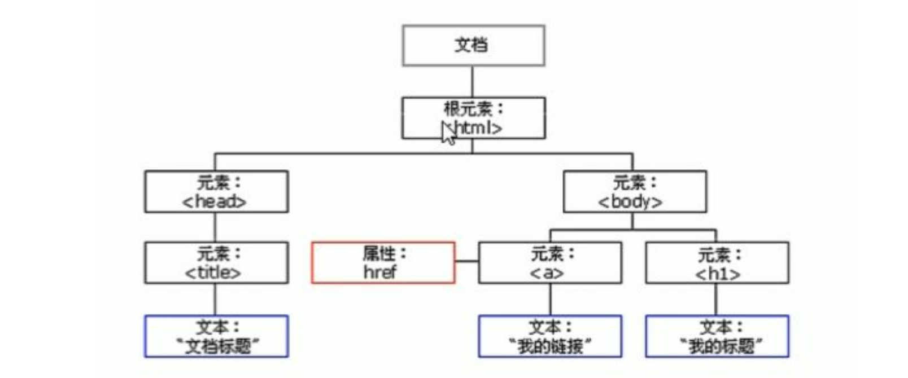
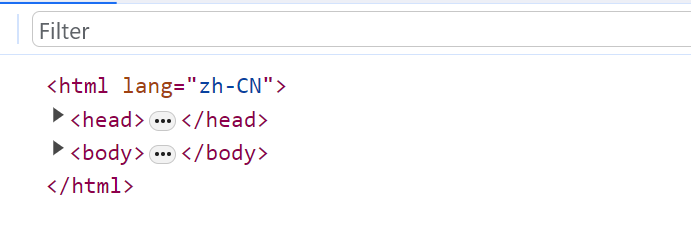
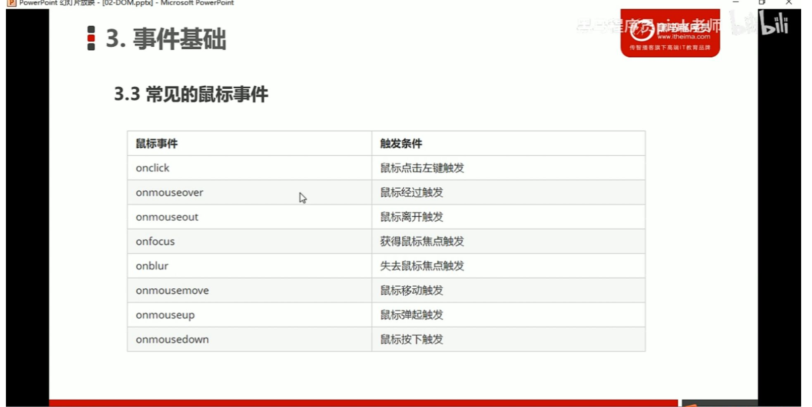
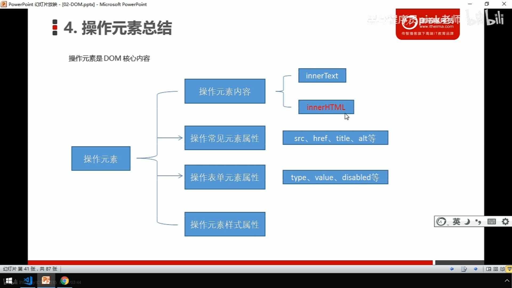

# API   

应用程序编程接口

# web APIs

页面交互效果 浏览器的API

### DOM

文档对象模型

 可以改变网页内容结构和样式

##### DOM树




DOM把上面的内容都看做对象

#### 获取元素

- 根据ID获取

  ```js
  <body>
      <div id="time">
          2023-12-9
      </div>
      <script>
          // 因为文档页从上往下加载，所以先得有标签
          // get 获得 Element元素 BY通过
          // 参数 id是大小敏感的字符串
          var timer = document.getElementById('time');//返回的是对象
          console.log(timer);
          console.log(typeof timer);
          console.dir(timer);
      </script>
  </body>
  
  ```

  - 根据标签名获取

    ```js
    <ul>
                <li>1111111111111111111111</li>
                <li>222222222222222222222</li>
                <li>3333333333333333333333</li>
                <li>44444444444444444444</li>
                <li>55555555555555555555</li>
            </ul>
            <script>
            // 返回的是元素对象的集合 以伪数组的形式存储
                var list = document.getElementsByTagName('li');
                console.log(list);
                console.log(list[0]);
                // 遍历
                for(var i = 0;i < list.length;i++){
                    console.log(list[i]);
                }
                // 如果页面中只有一个，还是伪数组
                // 如果页面中啥也没有，返回的还是伪数组
                
    ```

    还可以获取某个父元素内部所有指定标签名的子元素（父元素必须是单个，必须指明是哪一个元素对象）

    ```js 
    <ol>
                <li>1111111111111111111111</li>
                <li>222222222222222222222</li>
                <li>3333333333333333333333</li>
                <li>44444444444444444444</li>
                <li>55555555555555555555</li>
            </ol>
            <script>
                var ol = document.getElementsByTagName('ol');//[ol]
                console.log(ol[0].getElementsByTagName('li'));
            </script>
    ```

    但是一般情况都是给ol取ID

    - html5新增

      1.根据类名获得某些元素的集合

      ```js 
      <div class="box">盒子哦</div>
              <div class="box">盒子哦</div>
              <script>
              var box = document.getElementsByClassName('box');
              console.log(box);
              </script>
      ```

      2.返回指定选择器的第一个元素对像

      ```js
      <div class="box">盒子哦111</div>
              <div class="box">盒子哦222</div>
              <script>
                  var firstBox = document.querySelector('.box');
                  console.log(firstBox);
              </script>
      ```

      

      3.返回指定选择器所有元素的对象

      ```js
       <div class="box">盒子哦111</div>
              <div class="box">盒子哦222</div>
             <script> 
             var allBox = document.querySelectorAll('.box');
             console.log(allBox);
             </script>
      ```

      

- 获取特殊元素(body html)

  1.获取body标签

  ```js
   <script>
          var bodyEle = document.body;
          console.log(bodyEle);
      </script>
  
  ```

  

  2.获取html文件

  ```js 
  <script>
      var htmlEle = document.documentElement;
      console.log(htmlEle);
   </script>
  ```

  



##### 事件基础

- ##### 事件概述

  JavaScript使我们有能力创建动态页面，而事件是可以被js侦探到的行为

  简单：触发---响应

  网页中每个元素都可以产生某些可以触发js的事件

  ###### 事件由三个部分组成

  1.事件源：事件被触发的对象      谁 按钮

  ```js
  <button id="btn">唐伯虎</button>
      <script>
          var btn = document.getElementById('btn');
      </script>
  ```

  2.事件类型 如何触发 什么事件比如：鼠标点击 鼠标经过 还是键盘按下

  最简单的：鼠标点击(onclick)

  3.事件处理程序 通过一个函数赋值的方式完成

  - ###### 执行事件的步骤

    ```js
     <div>2145</div>
        <script>
            var div = document.querySelector('div');
            div.onclick;
            div.onclick = function(){
                console.log('我被选中了');
            }
        </script>
    ```

    1、获取事件源

    ```js
     var div = document.querySelector('div');
    ```

    2、注册事件 綁定事件

    ```js
      div.onclick;
    ```

    3、添加事件处理程序 通过一个函数赋值的方式完成

    ```js 
    div.onclick = function(){
                console.log('我被选中了');
            }
    ```

    

- ##### 操作元素

  ###### 1、改变元素内容（innerText)
  
  ```js
  <button>显示当前系统时间</button>
       <div>某个时间</div>
       <script>
          var btn = document.querySelector('button');
          var div = document.querySelector('div');
              btn.onclick = function(){
              div.innerText = getTheDate();
          }
          function getTheDate(){
              var date = new Date();
            /*   console.log(date.getFullYear());
              console.log(date.getMonth() + 1);
              console.log(date.getDate());
              console.log(date.getDay);//周日返回0 */
              var year = date.getFullYear();
              var month  = date.getMonth() + 1;
              var date1 = date.getDate();
              var day = date.getDay();
              var str = ['星期日','星期一','星期二','星期三','星期四','星期五','星期六']
              return year + '年' + month + '月' + date1 + '日 ' + str[day];
          }
       </script>
  ```
  
  
  
  当我们点击了按钮，div里面的元素就会发生变化
  
  1、获取元素
  
  ```js
          var btn = document.querySelector('button');
  		var div = document.querySelector('div');
  ```
  
  

2、注册事件

```js
  btn.onclick 
```

3.添加事件处理程序 

```js
 btn.onclick = function(){
            div.innerText = getTheDate();
        }
        function getTheDate(){
            var date = new Date();
          /*   console.log(date.getFullYear());
            console.log(date.getMonth() + 1);
            console.log(date.getDate());
            console.log(date.getDay);//周日返回0 */
            var year = date.getFullYear();
            var month  = date.getMonth() + 1;
            var date1 = date.getDate();
            var day = date.getDay();
            var str = ['星期日','星期一','星期二','星期三','星期四','星期五','星期六']
            return year + '年' + month + '月' + date1 + '日 ' + str[day];
        }
```

//我们元素可以不用添加事件

```js
 <div>123</div>
     <script>
        var div = document.querySelector('div');
        
            div.innerText = getTheDate();
        
        function getTheDate(){
            var date = new Date();
            var year = date.getFullYear();
            var month  = date.getMonth() + 1;
            var date1 = date.getDate();
            var day = date.getDay();
            var str = ['星期日','星期一','星期二','星期三','星期四','星期五','星期六']
            return year + '年' + month + '月' + date1 + '日 ' + str[day];
        }
     </script>
```

- innerText 与innerHTML区别

  innerText不识别HTML的标签 去除空格和换行 非标准

  innerHTML识别HTML的标签

  这两个标签可读写，能获得里面的内容

  ```Js
  <div>123</div>
       <script>
          var div = document.querySelector('div');
          
              // div.innerText = '';
      
          console.log(div.innerText);
       </script>
  ```

  

  ```js
    <div>123</div>
       <script>
          var div = document.querySelector('div');
          
              div.innerText = '12234346';
      
          console.log(div.innerText);
       </script>
  ```

  

###### 常用元素属性操作

```js
 <button id="x">魈</button>
     <button id="wd">温迪</button>
     
     <script>
        var x = document.getElementById('x');
        var wd = document.getElementById('wd');
        var img = document.querySelector('img');
        wd.onclick = function(){
            img.src = '../img/002.jpg';
        }
     </script>
```

案例：问好

```js
<!DOCTYPE html>
<html lang="zh_CN">

<head>
    <meta charset="UTF-8">
    <meta name="viewport" content="width=device-width, initial-scale=1.0">
    <title>问好</title>
    <style>
        img {
            width: 300px;
            height: 400px;
        }
    </style>
</head>

<body>

    
    <script>
        var img = document.querySelector('img');
        var date = new Date();
        var time = date.getHours();
        if (time < 12) {
            img.src = "./img/上午好.jpg";
        } else if (time >= 12 && time < 18) {
            img.src = "./img/下午好.jpg";
        } else {
            img.src = "./img/晚上好.jpg";
        }

    </script>
</body>

</html>
```

###### 3、表单属性操作

表单里面的值是通过value来修改的

```js
<button>按钮</button>
    <input type="text" value="输入内容">
    <script>
        var  btn = document.querySelector('button');
        var input = document.querySelector('input');
        btn.onclick = function(){
            input.value = "已提交";
        }
    </script>
```


如果想要表单被禁用，不能再点击

```js
  btn.disabled = true;
  this.disabled = true;
//this 指的是事件函数的调用者
```



###### 排他思想

```js
  
    <script>
        // 获取所有button元素
        var btn = document.querySelectorAll('button');
        // btn 得到的是伪数组 里面的每一个元素 btns[i]
        for(var i = 0; i < btn.length;i++){
            btn[i].onclick = function(){
                this.style.color = 'red';
                console.log(i);
            }
        }
    </script>
```

这样会造成每一个点击过的按钮都是red

